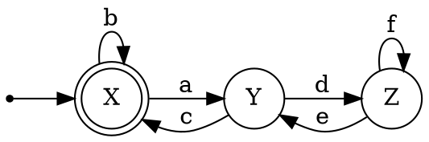

```graphviz
digraph finite_state_machine {
    rankdir=LR;
    size="8,5"

    node [shape = doublecircle]; X;
    node [shape = point ]; A

    node [shape = circle];
    A -> X;
    X  -> Y [ label = "a" ];
    X  -> X  [ label = "b" ];
    Y -> X  [ label = "c" ];
    Y -> Z [ label = "d" ];
    Z -> Y [ label = "e" ];
    Z -> Z [ label = "f" ];
}
```